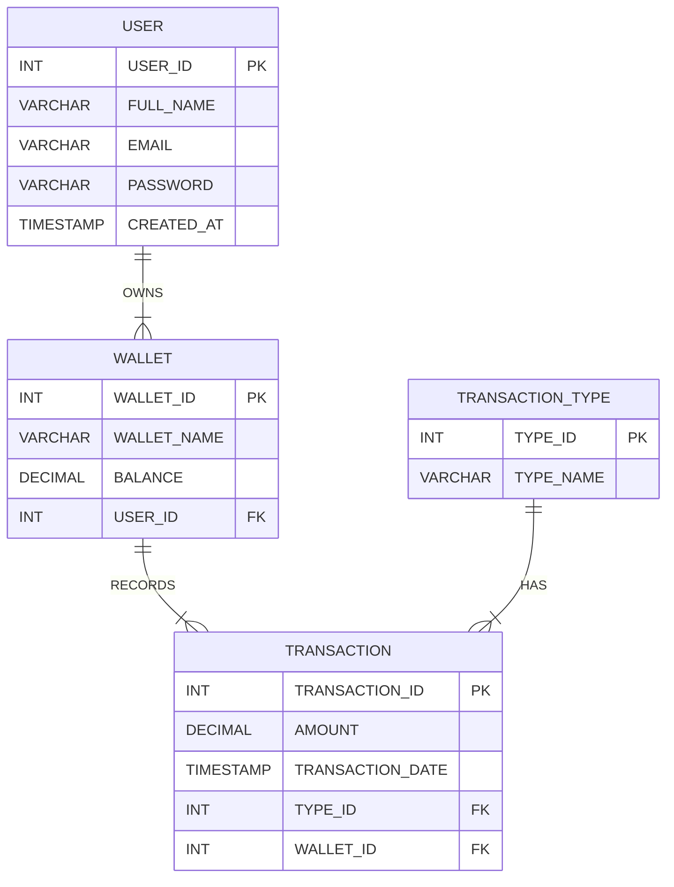

# E-wallet

```mermaid 
erDiagram

USER {
    INT USER_ID PK
    VARCHAR FULL_NAME
    VARCHAR EMAIL
    VARCHAR PASSWORD
    TIMESTAMP CREATED_AT
}

WALLET {
    INT WALLET_ID PK
    VARCHAR WALLET_NAME
    DECIMAL BALANCE
    INT USER_ID FK
}

TRANSACTION_TYPE {
    INT TYPE_ID PK
    VARCHAR TYPE_NAME
}

TRANSACTION {
    INT TRANSACTION_ID PK
    DECIMAL AMOUNT
    TIMESTAMP TRANSACTION_DATE
    INT TYPE_ID FK
    INT WALLET_ID FK
}

USER ||--|{ WALLET : OWNS
WALLET ||--|{ TRANSACTION : RECORDS
TRANSACTION_TYPE ||--|{ TRANSACTION : HAS
```
<!-- TYPE = TOP-UP, PAYMENT, TRANSFER-OUT, TRANSFER-IN, REFUND -->
<!-- 1 wallet bisa banyak transaksi -->
