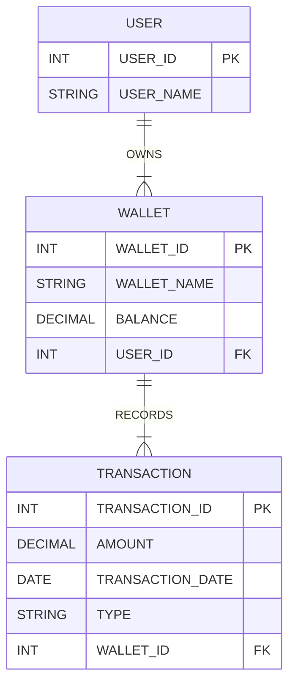

# E-wallet

```mermaid 
erDiagram

USER {
    INT USER_ID PK
    STRING USER_NAME
}

WALLET{
    INT WALLET_ID PK
    STRING WALLET_NAME
    DECIMAL BALANCE
    INT USER_ID FK
}

TRANSACTION {
    INT TRANSACTION_ID PK
    DECIMAL AMOUNT
    DATE TRANSACTION_DATE
    STRING TYPE
    INT WALLET_ID FK
}

USER ||--|{ WALLET : OWNS
WALLET ||--|{ TRANSACTION : RECORDS

```
<!-- TYPE = TOP-UP, PAYMENT, TRANSFER-OUT, TRANSFER-IN, REFUND -->